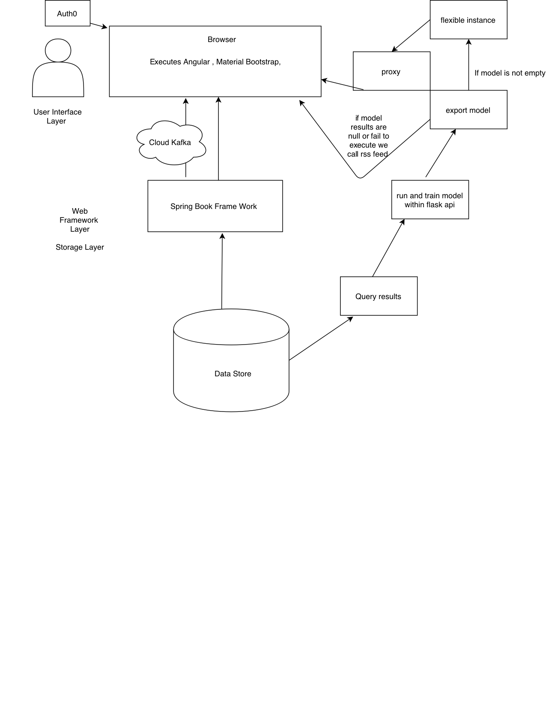

## This repository is for Computer Science 680 at California State University Northridge. 

# Comp-680
### The goal is to establish a platform that would give society the opportunity to have a platform to apply to jobs. This platform would support four different types of users. It would support a guest, a registered user, and recruiter.

## To run back-end:
``` bash
cd backend
# install dependencies
mvn clean install
# start server
mvn spring-boot:run
```

## To run front-end:
``` bash
cd frontend
# install dependencies
npm install
# start server
ng serve
```

## Repo for Personalized Recommendations api 
https://github.com/vanessailana/Seminar2


## Application hosted on:
https://serene-mountain-68375.herokuapp.com/

## Backend API 
https://agile-scrubland-47616.herokuapp.com/


## Overall Architecture



